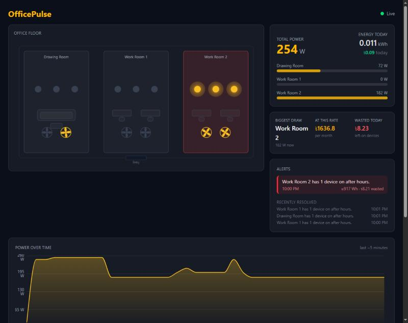
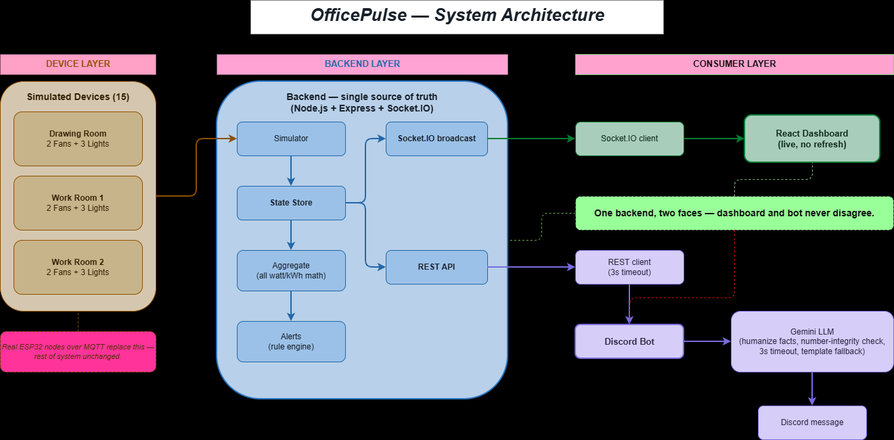

# OfficePulse

Real-time monitoring for a small office's lights and fans. One backend simulates 15
devices (3 rooms × 2 fans + 3 lights), and pushes live state to a web dashboard and a
Discord bot — so both always show the same numbers.



## Problem

A small office runs lights and fans across three rooms. Nobody has a single, live view of
what is on, how much power is being drawn, or how much it costs — and devices get left on
after hours, quietly wasting energy and money. OfficePulse gives the office one real-time
picture of every device, flags anomalies automatically, and answers questions from Discord,
so the same facts reach a wall dashboard and the team chat at the same time.

## What it does — features at a glance

Every number below is computed **once, in the backend** (`backend/src/aggregate.js`) and only
read by the dashboard and bot, so the two can never disagree.

| Feature | What the judge sees | Exact numbers behind it |
|---|---|---|
| **Live device grid** | 15 devices across 3 rooms flip on/off with no page refresh | 3 rooms × (2 fans + 3 lights); pushed over Socket.IO on every change |
| **Power meter** | Total watts + per-room breakdown, updating live | Sum of watts of all `on` devices; max load = **546 W** (all 15 on) |
| **Energy today** | kWh accumulated over the day | `kWh = Σ(watts × seconds) / 3,600,000`, integrated every 5 s tick |
| **Cost today (BDT)** | e.g. `৳5.64 today` under the meter and in `!usage` | `cost = kWh × ৳8.95/kWh` (Bangladesh commercial tariff) |
| **Live power chart** | A "Power over time" area chart under the floor map | Plots the **last 60 samples** (one per 5 s ≈ last **5 minutes**) |
| **Anomaly alerts** | Red cards on the dashboard + ⚠️ to Discord | Two rules, checked every **30 s** (below) |
| **Wasted-energy figure** | e.g. `≈910 Wh · ৳8.14 wasted` on each alert | `Wh = watts × hours-on`, valued at the tariff, updated live |
| **Cost intelligence** | Insights strip: biggest-draw room, `≈৳1591/month` at this rate, `৳X wasted today` | `GET /api/insights`, computed once in `backend/src/insights.js` |
| **Ask-anything bot** | `!ask which room wastes the most?` → a friendly, accurate answer | LLM answers from backend facts only; number-checked; deterministic fallback |
| **Office floor map (isometric SVG)** | Tilted top-view 3D-style layout: glowing light pools, spinning ceiling fans, alert rooms pulse red | Pure SVG, no extra dependency; bound directly to live device state |

> Note: the problem statement's own device count is inconsistent (15 on page 1, 18 elsewhere).
> We follow the fixed office setup — 3 rooms × 5 devices (2 fans + 3 lights) = **15 devices**.
| **Discord bot** | `!status`, `!room`, `!usage` answered with real data | 3 s REST timeout; polite fallback if backend is down |
| **AI humanizer** | Friendly, varied bot wording | Gemini rephrases **facts only**; number-integrity checked; template fallback |
| **One-command Docker** | `docker compose up --build` runs the whole stack | Built & verified: Node 20 Alpine image, ports 3001 + 5173 |

### Alert rules (checked every 30 s)

- **After-hours** — any device on **outside 09:00–17:00** office hours.
- **2-hours-continuous** — a whole room fully on for **more than 2 hours**.

Alerts are de-duplicated (they fire **once**, not every tick), timestamped on the simulation
clock, and auto-resolve when the condition clears. Each alert also carries a live `wastedWh`
estimate: for after-hours it counts from office close (17:00), for the 2-hour rule it counts
from when the room became fully on.

### Device power ratings (fixed at seed)

| Device | Watts |
|---|---|
| Fan 1 | 65 W |
| Fan 2 | 72 W |
| Light 1 | 15 W |
| Light 2 | 12 W |
| Light 3 | 18 W |

Per room fully on = **182 W** (137 W fans + 45 W lights). Three rooms = **546 W** peak.

## What makes it stand out

- **One backend, two faces.** The dashboard and the Discord bot read the *same* pre-computed
  numbers, so they can never show conflicting figures — a common failure in split systems.
- **An AI that cannot lie.** The bot uses Gemini only to reword facts; a number-integrity check
  rejects any reply whose numbers don't match the source, and it falls back to templates. Pull
  the API key and it stays 100% accurate.
- **Waste and money, not just watts.** Alerts show energy actually wasted (`≈910 Wh`) and the
  meter shows real cost in Taka (`৳5.64 today`) — the office sees the problem in its own terms.
- **Runs anywhere in one command.** `docker compose up --build` brings the whole stack up with
  no Node install and no keys — built and verified, not just a Dockerfile on paper.

## Architecture

One backend is the **single source of truth**. It owns state, does all the math, and exposes
the same facts two ways — a Socket.IO stream for the dashboard and a REST API for the bot.



15 simulated devices flow into the backend's simulator, which updates one shared state store.
Aggregate turns that state into watts/kWh/cost, and alerts watches it for anomalies — nothing
downstream ever recomputes a number. From there the same facts fan out two ways: Socket.IO
pushes them straight to the React dashboard for live, no-refresh updates, while the REST API
feeds the Discord bot (3 s timeout), which hands the facts to Gemini to phrase a friendly reply.
A real ESP32 deployment would only replace the device layer over MQTT — everything to its right
stays the same.

Full diagram: [`docs/system-diagram.drawio`](docs/system-diagram.drawio) (draw.io source).
Data contract: [`docs/api-contract.md`](docs/api-contract.md).

**Why this shape:** because the dashboard and the bot read the *same* pre-computed numbers,
they are always consistent. The frontend and the LLM never compute or invent a value.

## Simulation design

The simulator (`backend/src/simulator.js`) models a realistic office day on its own clock:

- **5-second tick.** Each tick nudges devices toward a schedule-driven target and integrates
  energy for the elapsed time.
- **Daily schedule.** Work rooms ramp on **08:45–09:15**, dip at lunch (**12:00–13:00**), and
  switch off **17:00–18:00**; the drawing room is used sporadically.
- **`SIM_SPEED`** multiplier accelerates the clock so a full day (and a believable kWh figure)
  fits inside a 3-minute demo video. The simulation clock — never wall-clock — drives office
  hours and alerts.
- **Deterministic demo scenarios** (`POST /api/sim/scenario/:name`):
  `forgot-devices` (Work Room 2 left fully on, clock jumped to 22:00 → fires alerts),
  `all-off`, `business-hours`, and `reset`. Run `npm run demo:alert` to trigger one on camera.

Swapping the simulator for real hardware changes nothing downstream — the rest of the system
consumes the same device JSON.

### Recording the demo video

Real-time speed can look too static in a short recording. For a livelier take, set the sim
clock to just before the 08:45 ramp-up and speed it up, so devices visibly switch on as the
schedule plays out:

```bash
SIM_HOUR=8 SIM_SPEED=20 npm run dev:all      # bash
$env:SIM_HOUR=8; $env:SIM_SPEED=20; npm run dev:all   # PowerShell
```

Then, once the dashboard is up: `npm run demo:warmup` gives an instant lively mix of devices
across all rooms (good opening shot), and `npm run demo:alert` triggers the forgot-devices
alert on camera. Since flips are probabilistic, do a couple of dry runs before recording for
real. Revert to plain `npm run dev:all` afterward — judges cloning the repo should see
realistic real-time behavior, not the sped-up recording settings.

## Hardware / Wokwi

_Pending — ESP32 circuit (Wokwi) and pin-mapping table delivered by the hardware track; the
same device JSON schema as [`docs/api-contract.md`](docs/api-contract.md) proves the pipeline._

## Tech stack

| Layer | Choice |
|---|---|
| Backend | Node.js 20 + Express + Socket.IO |
| Dashboard | React + Vite + Tailwind |
| Bot | discord.js v14 |
| LLM | Gemini (free tier), with template fallback |

## Setup

```bash
cp .env.example .env      # backend + dashboard need ZERO keys; bot is optional-with-token
npm install
npm run dev:all
```

Run the unit tests (pure backend math + LLM number-integrity guard, zero extra deps):

```bash
npm test
```

- Dashboard: http://localhost:5173
- Backend: http://localhost:3001
- Bot: connects only if `DISCORD_TOKEN` is set; otherwise it skips gracefully.

### Run with Docker (one command)

No Node install needed — just Docker Desktop:

```bash
docker compose up --build
```

- Dashboard: http://localhost:5173
- Backend: http://localhost:3001

The dashboard and backend need **zero keys**. To enable the Discord bot, copy
`.env.example` to `.env`, fill in the tokens, and uncomment the `env_file:` block in
`docker-compose.yml`.

## Bot commands

| Command | Description | Example reply |
|---|---|---|
| `!status` | Summary of all rooms | `🏢 Office status — 8/15 devices on, 414 W total (~0.5 kWh today).` |
| `!room <name>` | One room's devices (fuzzy name match) | `💡 Work Room 2 — 5/5 on, 182 W.` |
| `!usage` | Watts + kWh + **cost today** | `⚡ Drawing 414 W right now (~0.5 kWh, ৳4.48 today).` |
| `!alerts` | Active anomalies right now | `🚨 1 active alert:\n⚠️ [10:00 PM] Work Room 2 has 5 devices on after hours. (৳8.15 wasted)` |
| `!cost` | Today's bill + monthly projection | `💰 Today's bill so far: ৳0.19 (~0.021 kWh). At this rate, about ৳2461.5 this month.` |
| `!waste` | Biggest draw + wasted cost today | `🔍 Biggest draw right now: Work Room 1 (182 W). Wasted today: ৳0.` |
| `!ask <question>` | **Natural-language Q&A** over live facts | `!ask which room wastes the most?` → `💸 Work Room 2 — ৳8.14 already.` |
| `!help` | Lists every command | — |

Room names are fuzzy-matched, so `work2`, `workroom2`, `work 2`, and `drawing` all resolve.
If the backend is unreachable, the bot replies politely instead of crashing.

## AI integration

The LLM is a **presentation layer only** — it rephrases facts into friendlier wording and
**never computes, adds, or invents a number**. Every safeguard below is real and testable:

- **Facts in, words out.** The backend hands the bot exact numbers; Gemini
  (`gemini-2.5-flash`) is asked only to reword them.
- **3-second timeout, 1 retry.** If Gemini is slow or fails, the bot falls back to a
  deterministic template — the reply is still correct, just less chatty.
- **Number-integrity check.** Every number in the LLM's reply must already exist in the
  facts; if a single number doesn't match, the reply is discarded and the template is used.
- **Prompt-injection resistant.** Facts are treated as data, never as instructions — the bot
  ignores any commands embedded in device labels or user text.
- **Conversational `!ask`.** Free-text questions are answered from a comprehensive backend
  facts object; the same number-integrity check applies, and with no key it falls back to a
  deterministic summary — so `!ask` is always correct, never silent.
- **Works with no key.** With `GEMINI_API_KEY` unset (or `BOT_LLM=off`), the bot is just as
  accurate via templates — zero visible errors.
- **Proactive alerts.** With `PROACTIVE=on`, the bot polls `/api/alerts` every 5 s and posts a
  humanized ⚠️ to `#alerts`, de-duplicated by alert id so a condition is announced once.

Result: the AI makes the bot pleasant to read, but accuracy never depends on it.

## Contributions

| Area | Owner |
|---|---|
| Backend, dashboard, Discord bot, AI layer, Docker | Software track |
| ESP32 circuit, Wokwi, system diagram, hardware docs | Hardware track |

_Fill in each teammate's name against their track before submission._

## Attribution

Built with Express, Socket.IO, React, Vite, Tailwind, discord.js, and the Google Gemini API.

## Future scope

Swap the simulator for real ESP32 nodes publishing over MQTT — the rest of the system
is unchanged.
