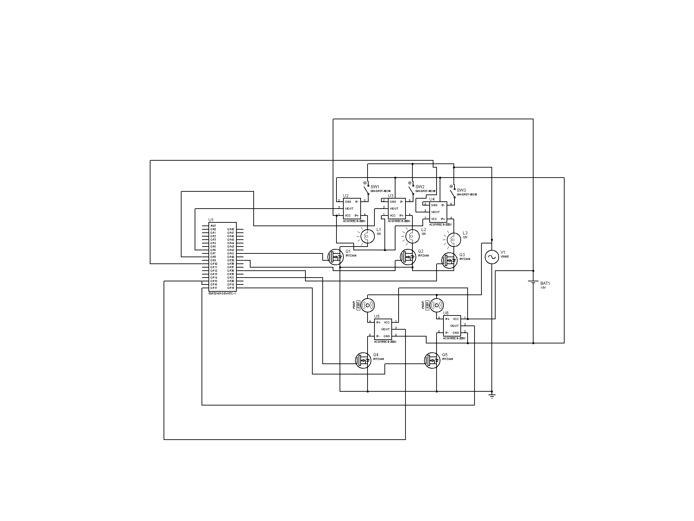

# Hardware — ESP32 load-sensing circuit

The schematic below is the physical proof of one office room: an **ESP32-S3** that
independently switches and current-monitors **five AC loads** — three lamps and two fans.
The software backend simulates three of these rooms (15 devices), but every device it models
maps one-to-one onto a real sense-and-switch channel shown here.

## How one channel works

Each load sits in its own path from the AC source to ground, and that path does two jobs at once:

- **Switching.** The load is in series with an **IRFZ44N** N-channel MOSFET (`Q1`–`Q5`). The
  gate is driven straight from an ESP32 GPIO, so the firmware turns each load fully on or off in
  software. The three lamp channels also have a manual momentary switch (`SW1`–`SW3`) as a
  local override.
- **Sensing.** An **ACS758ECB-200U** Hall-effect current sensor (`U2`–`U6`) sits in series with
  the same load. Its analog `VOUT` feeds an ADC-capable ESP32 pin, giving a live per-load current
  reading the firmware samples continuously.
- **Isolation.** The sensors are biased from a separate DC source (`BAT1`), kept off the ESP32
  and AC rails so the sensing side stays electrically clean.

Because switching and sensing share one series path, the ESP32 always knows both *whether* a
load is on and *how much* it is actually drawing — the two facts the dashboard needs.

## Channel map

| Channel | Load | Current sensor | MOSFET | Manual override |
|---|---|---|---|---|
| 1 | Lamp `L1` (12 V) | `U2` ACS758ECB-200U | `Q1` IRFZ44N | `SW1` |
| 2 | Lamp `L2` (12 V) | `U3` ACS758ECB-200U | `Q2` IRFZ44N | `SW2` |
| 3 | Lamp `L3` (12 V) | `U4` ACS758ECB-200U | `Q3` IRFZ44N | `SW3` |
| 4 | Fan 1 | `U5` ACS758ECB-200U | `Q4` IRFZ44N | — |
| 5 | Fan 2 | `U6` ACS758ECB-200U | `Q5` IRFZ44N | — |

> The two fan channels use a buzzer symbol as a stand-in load in the capture tool; electrically
> they are identical sense-and-switch channels to the lamps.

## Bill of materials

| Ref | Part | Role |
|---|---|---|
| `U1` | ESP32-S3-DevKitC-1 | MCU — GPIO drives the gates, ADC reads the sensors |
| `U2`–`U6` | ACS758ECB-200U | Hall-effect current sensor, one per load |
| `Q1`–`Q5` | IRFZ44N | N-channel MOSFET, low-side switch per load |
| `L1`–`L3` | 12 V lamp | Lamp loads |
| `SW1`–`SW3` | SPST momentary | Manual override on the lamp channels |
| `V1` | AC source (VSINE) | Load supply |
| `BAT1` | DC source | Isolated bias for the current sensors |

## How the circuit maps to the software

This board proves **one room's** sense-and-switch path. The backend simulator
(`backend/src/simulator.js`) reuses the same per-device model across three rooms, producing the
15 devices the dashboard and bot report on. Swapping the simulator for real ESP32 nodes
publishing this same per-load JSON changes nothing downstream — the backend, dashboard, and bot
consume identical data either way.

The deployed product is **monitoring-only**: the dashboard and bot read live state and never
send control commands. The MOSFET switching shown here is a hardware capability the firmware
owns locally; exposing it as remote control is out of scope for this MVP.
